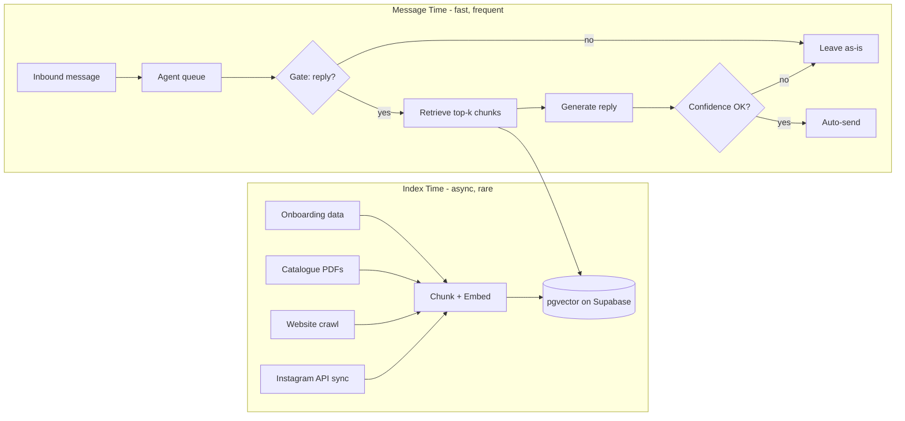

# Responza Auto-Reply Agent — Plan

## Decision summary

- **Build the agent ourselves** (no turnkey product; use components only where helpful).
- **Implement inside the existing Node/TypeScript backend** (no separate Python API).
- **Core rule:** index knowledge **once / on change**; at message time only **retrieve + decide + maybe reply** — never crawl PDFs or websites per inbound message.

---

## Architecture: two systems

| System | When it runs | What it does |
|--------|--------------|--------------|
| **Knowledge Indexer** | Onboarding complete, profile update, catalogue upload, periodic refresh | Reads files, crawls website, syncs Instagram via API → chunks → embeddings → vector store |
| **Reply Agent** | Every inbound message (async, debounced) | Cheap gate → vector search → generate reply → send only if confident; otherwise **leave thread untouched** |



---

## What gets indexed (and how)

| Source | Ingestion | Refresh |
|--------|-----------|---------|
| **Brand + business description** | Small “core context” (always in prompt) | On profile save |
| **Catalogue files** (PDF, DOCX, XLSX, etc.) | Extract text → chunk → embed | On upload/delete |
| **Website** | Crawl domain (sitemap, limited pages) | On save + weekly |
| **Instagram** | Graph API: bio, recent post captions | Daily (existing OAuth) |

**Note:** Facebook page URL may be collected during onboarding, but there is no Facebook OAuth today — do not index or search Facebook content until a page connection exists.

**Important:** “Search socials/website” means **semantic search over pre-indexed content**, not live browsing per message.

**Optional later (“Business Brain”):** nightly job compiles all chunks into compact `business_facts.json` (products, policies, FAQs) for faster, more consistent replies.

---

## Why pgvector (not a new database)

Plain Postgres (Supabase) handles exact lookups — org ID, messages, profile fields — but cannot semantically match a customer question to the right paragraph in a large catalogue or website.

**pgvector on the existing Supabase DB** stores embeddings so the agent retrieves only a few relevant chunks per message instead of stuffing entire files into every LLM call — faster, cheaper, and within token limits.

---

## Reply agent flow (per inbound message)

**Hook:** after `receiveInboundMessage()` succeeds (non-duplicate) → enqueue agent job (delayed + debounced per conversation).

### Step 0 — Guards (no LLM)

- Auto-reply enabled for org
- Subscription active
- Text message only (skip media in v1)
- Not duplicate / not outbound echo
- Optional: human replied recently → skip
- **Debounce ~2–3s** per conversation (batch rapid messages)

### Step 1 — Gate (cheap, small model)

```json
{
  "action": "skip" | "reply",
  "reason": "greeting_only" | "needs_human" | "answerable" | "insufficient_context",
  "confidence": 0.0
}
```

**Default: skip.** Only continue when clearly answerable.

### Step 2 — Retrieve (~50–150ms)

- Embed inbound message (or hybrid keyword + vector)
- Query org-scoped index: `top_k = 5–8`
- Include core profile + last ~10 thread messages

### Step 3 — Generate + verify

```json
{
  "reply": "...",
  "confidence": 0.92,
  "sources_used": ["catalogue:price-list.pdf", "website:/shipping"],
  "should_send": true
}
```

**Send only if:**

- `should_send === true`
- `confidence >= threshold` (e.g. 0.85–0.9)
- No invented prices/dates/order IDs
- Passes policy rules (refunds, complaints, legal → skip)

Otherwise: **do nothing** (message stays as-is).

---

## Speed, scale, and load

### Fast

- Pre-index everything (no PDF/website work on hot path)
- Redis cache for core profile + agent settings
- Conversation debounce (1 job per burst)
- Two-stage LLM: gate → generate
- Cap retrieved context (~2–3k tokens)

**Target:** p50 ~2–4s, p95 < 8s for messages that actually reply.

### Scalable

- Separate **`agent-jobs`** queue (don’t compete with suggest-reply / analytics)
- Per-org + global worker concurrency limits
- Idempotent jobs: `agent-{messageId}`
- Low-priority **`knowledge-index`** queue
- Org-scoped vector queries (`organization_id` filter)
- Feature flag per org for rollout

### Low server load

- Gate skips 60–80% of messages before heavy work
- Index on change, not on message
- Sync Instagram daily, not per message
- Default action = **skip**

---

## Codebase layout (existing backend)

```
backend/src/modules/
  knowledge/              # NEW
    extractors/           # pdf, docx, xlsx, html
    crawlers/             # website (limited depth)
    syncers/              # instagram
    indexer.service.ts

  agent/                  # NEW
    agent.gate.ts
    agent.retrieve.ts
    agent.reply.ts
    agent.policies.ts
    agent.worker.ts
```

**Queues (BullMQ + Redis):**

- `knowledge-index` — profile / catalogue / website / Instagram sync
- `agent-evaluate` — inbound message evaluation

**Triggers:**

1. `completeBusiness` / `updateBusiness` / catalogue upload → `knowledge-index`
2. `receiveInboundMessage` (success, inbound, text) → `agent-evaluate` (debounced)

**Storage (new tables):**

- `organization_knowledge_chunks` — text, embedding, source, metadata, `organization_id`
- `organization_knowledge_index_state` — `last_indexed_at`, version, errors
- `agent_settings` — enabled, confidence threshold, business hours, etc.
- `agent_decisions` — log skip vs send, confidence, sources (debugging + trust)

**Vector search:** Supabase **pgvector** (extension on existing Postgres).

---

## Phased rollout

### Phase 1 — Foundation

- Index: profile text + catalogue content
- Agent: gate → retrieve → generate
- **No auto-send** — internal draft / suggestion only
- Measure skip rate + confidence distribution

### Phase 2 — Controlled auto-reply

- Opt-in per org in settings
- Text only, high confidence threshold (~0.9)
- Business hours toggle
- Hard blocks: refunds, complaints, “talk to human”

### Phase 3 — Social + website

- Website crawler on onboarding
- Instagram daily sync via existing integration

### Phase 4 — Smarter (optional)

- Better debounce / “customer still typing”
- Low confidence → handoff message or human queue
- Vision for product images in DMs

---

## Product defaults

1. **Agent OFF by default** — user enables “Auto-reply with AI” in settings
2. **Default action: skip** — reply only when clearly answerable
3. **Never crawl at message time**
4. **Log every decision** (`agent_decisions`)
5. **Separate indexing from replying** (different queues / concurrency)
6. **Use Meta APIs over scraping** for Instagram

---

## What we explicitly ruled out

| Option | Why not |
|--------|---------|
| Full products (Replio, Wati, etc.) | They *are* the inbox — replaces Responza |
| Separate Python backend | Extra ops; orchestration belongs in Node; use parser APIs or optional Python indexer worker only if needed later |
| Live agent per message (browse web/social) | Too slow, expensive, doesn’t scale |
| Facebook page indexing (for now) | No Facebook OAuth — skip until page connection is built |

**Hybrid components you can still buy:** Unstructured/LlamaParse (docs), Firecrawl (website), OpenAI embeddings — while we own gate + retrieve + send.

---

## One-line summary

> **Async knowledge indexer + conservative reply agent on BullMQ workers in the existing backend, with pgvector retrieval and skip-by-default behavior.**
